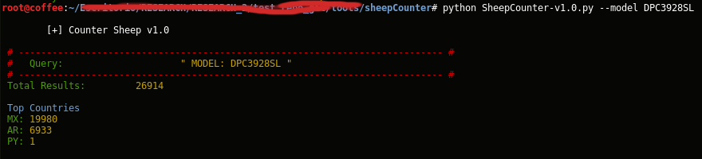
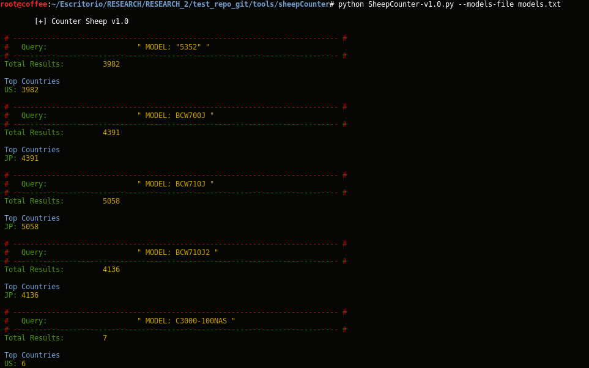
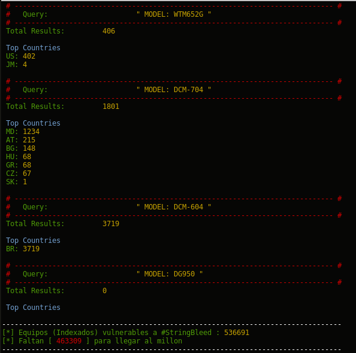

# tool: Sheep Counter v 1.0
## Simple python tool to get the total of models indexed in "shodan.io".


# SHODAN:
## (free) APIKEY: *MM72AkzHXdHpC8iP65VVEEVrJjp7zkgd*

```
	query		= 'MODEL: '
	cblMDL 		= "DPC3928SL"  		# --model <model>  
	cableModel 	= str(query+cblMDL)

	freeAPIKEY	= 'MM72AkzHXdHpC8iP65VVEEVrJjp7zkgd'
	api 		= shodan.Shodan(freeAPIKEY)
	countCBL 	= api.count(cableModel)

	print countCBL

```

# Quick start

* usr@pwn:~$ git clone https://github.com/stringbleed/tools.git
* usr@pwn:~$ cd sheepCounter
* usr@pwn:~$ python SheepCounter-v1.0.py  "--model <model cablemodem> / --models-file <file with models of cablemodems>"


# Search target: fingerprinting SNMP - oid sysDescr -  

* Cisco DPC3928SL DOCSIS 3.0 1-PORT Voice Gateway <<HW_REV: 1.0; VENDOR: Technicolor; BOOTR: 2.4.0; SW_REV: D3928SL-PSIP-13-A010-c3420r55105-160428a; *MODEL: DPC3928SL*>>
* Thomson CableHome Gateway <<HW_REV: 2.1; VENDOR: Thomson; BOOTR: 2.1.7i; SW_REV: ST9C.05.25; *MODEL: DWG850-4*>>
* etc...


# Demo:
## POC 1
Get total only ONE model:
```
	usr@pwn:~$ python SheepCounter.py --model DPC3928SL


```
## POC 2
Get total model of the list "models.txt":
```
	usr@pwn:~$ python SheepCounter.py --models-file models.txt

```

## screenshot
*one model*


*models in file: models.txt*

### *** (cut)



# MODELS LIST:
## Models vuln to: #stringbleed (CVE-2017-5135 )

* "5352"
* BCW700J
* BCW710J
* BCW710J2
* C3000-100NAS
* CBV734EW
* CBV38Z4EC
* CBV38Z4ECNIT
* CBW383G4J
* CBW38G4J
* CBW700N
* CG2001-AN22A
* CG2001-UDBNA
* CG2001-UN2NA
* CG2002
* CG2200
* CGD24G-100NAS
* CGD24G-1CHNAS
* CM5100
* CM5100-511
* CM-6300n
* DCX-3200
* DDW2600
* DDW2602
* DG950A
* DPC2100
* DPC2320
* DPC2420
* DPC3928SL
* DVW2108
* DVW2110
* DVW2117
* DWG849
* DWG850-4
* DWG855
* EPC2203
* EPC3212
* IB-8120-W21
* IB-8120-W21E1
* MNG2120J
* MNG6200
* MNG6300
* SB5100
* SB5101
* SB5102
* SBG6580
* SBG900
* SBG901
* SBG941
* SVG1202
* SVG2501
* T60C926
* TC7110.AR
* TC7110.B
* TC7110.D
* TC7200.d1I
* TC7200.TH2v2
* THG540
* THG541
* Tj715x
* TM501A
* TM502B
* TM601A
* TM601B
* TM602A
* TM602B
* TM602G
* TWG850-4U
* TWG870
* TWG870U
* U10C019
* U10C037
* VM1700D
* WTM552G
* WTM652G
* DCM-704
* DCM-604
* DG950S


# Total registered:

## update: 01/05/2017
* total: 536691

## update: 24/04/2017
* total: ----


# Security Researcher

### Bertin Jose (Costa Rica)  
* twitter: @bertinjoseb

### Fernandez Ezequiel (Argentina) 
* twitter: @capitan_alfa

